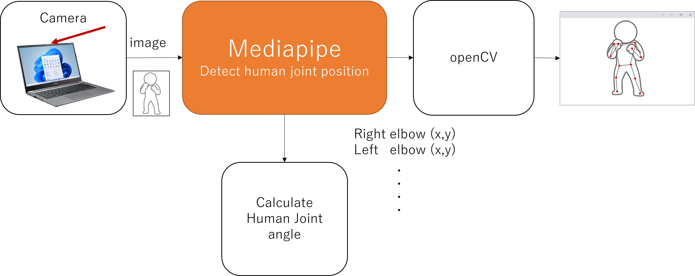
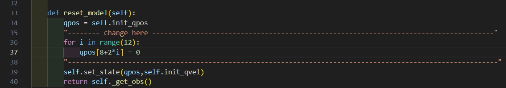
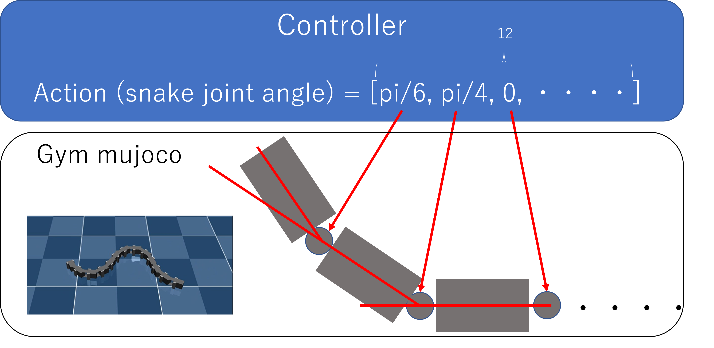
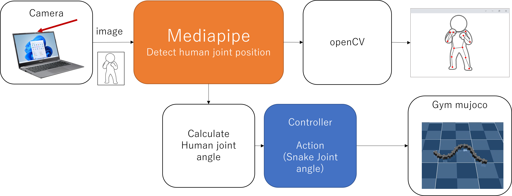
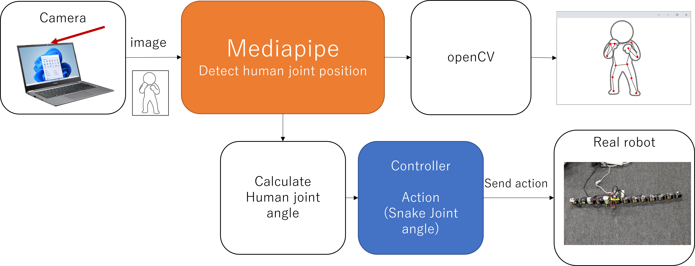

# Control snake robot by human pose detection

## Human pose detection
Pose detection by mediapipe

[mediapipe_test.py](mediapipe_test.py)



```
python mediapipe_test.py
```

## Control snake in simulator
Control snake robot in simulator(gym,mujoco).

**set initial joint angle**

[snake.py](snake.py)




[snake_sim_test.py](snake_sim_test.py)



```
python snake_sim_test.py
```

## Control snake robot by human pose detection (simulation)

[pose_snake_sim.py](pose_snake_sim.py)



```
python pose_snake_sim.py
```


## Control snake robot by human pose detection (real robot)

[pose_snake_real.py](pose_snake_real.py)



```
python pose_snake_real.py
```
