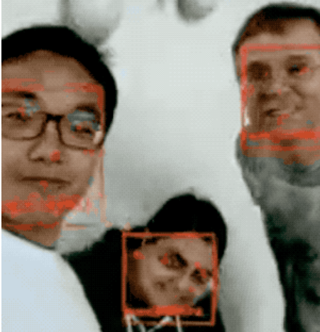
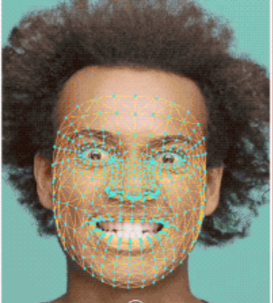
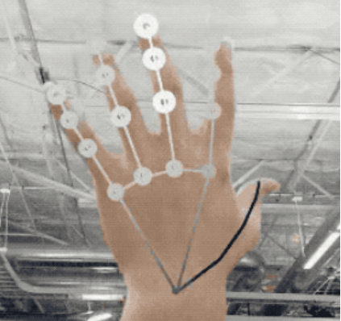
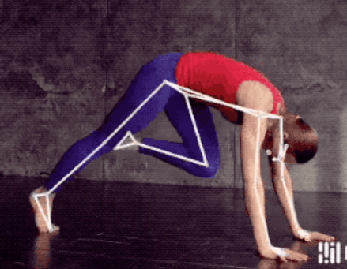

# Mediapipe Demonstration

## Face Detection Demo
~~~bash
python demo_face_detection.py
~~~

## Face Mesh Demo
~~~bash
python demo_face_mesh.py
~~~

## Hand Detection Demo
~~~bash
python demo_hand_detection.py
~~~

## Pose Detection
~~~bash
python demo_pose_detection.py
~~~

