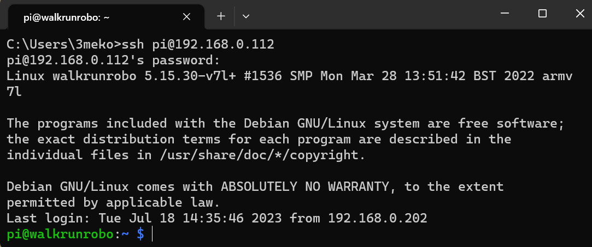
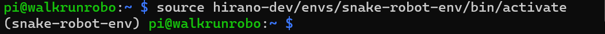
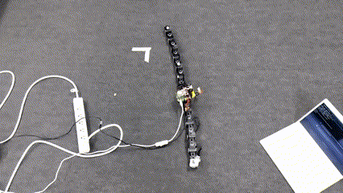
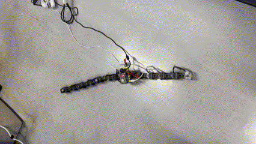

# How the Real Snake Robot Use

## Robot Setting

Connect 2 codes for power of RaspberryPi and motors as shown below.

## SSH connection

On your PC, open the terminal and input this command below.
~~~bash
ssh pi@192.168.0.112
~~~
You have to also input password.  
Password is 'hayashibelab'.
~~~bash
hayashibelab
~~~
It is okay if you can get this message as shown below.  

## Activate the Environment

To run scripts that control the snake robot, you need to activate the environment.  
Input this command below.
~~~bash
source hirano-dev/envs/snake-robot-env/bin/activate
~~~

if '(snake-robot-env)' appears on the left side of your terminal (as shown below), it means you have successfully activated the environment.

## Move to  the Workspace

You need to move the workspace to control the snake robot.  
Input the command below.
~~~bash
cd hirano-dev/projects/snake-robot-project/
~~~

## Snake Robot Test

### 1. Simple Control
Input following command to test controlling the snake robot.
~~~bash
python app/test_snake_control.py
~~~

### 2. Send Signals and Control
To control the snake robot, you need to send control signals from your PC.  
You can use Socket system with python.

At first, install 'keyboard' that is a library to recognize keyboard inputs on your PC.  
~~~bash
pip install keyboard
~~~

Then, copy and paste following script, and save it as 'test_socket.py'.
~~~python
from socket import socket,AF_INET,SOCK_DGRAM
import time
import keyboard
from math import pi

PORT=5000
CLIENT="192.168.0.112"

def main():
    sock=socket(AF_INET,SOCK_DGRAM)

    while True:

        try:
            #'msg' is each servo motor's angle[rad]. Maximum value is |pi/9.2|.
            if keyboard.read_key()=="d":
                msg=f"{pi/9.2},0,0,0,0,0,0,0,0,0,0,0" 
            elif keyboard.read_key()=="a":
                msg=f"{-pi/9.2},0,0,0,0,0,0,0,0,0,0,0"
            else:
                msg="0,0,0,0,0,0,0,0,0,0,0,0"
                 
            sock.sendto(msg.encode("utf-8"),(CLIENT,PORT))

        except KeyboardInterrupt:
            break

        print("your message : ",msg)
        time.sleep(0.1)

if __name__=="__main__":
    main()
~~~

Run above script with following command on your PC.
~~~bash
python test_socket.py
~~~

And input following command on RaspberryPi.
~~~bash
python app/snake_control_by_signal.py
~~~

You can control the head servo motor by keyboard.

## Turn Off the Snake Robot
Input following command.
~~~bash
sudo poweroff
~~~
you are required to input password.  
Password is 'hayashibelab'
~~~bash
hayashibelab
~~~